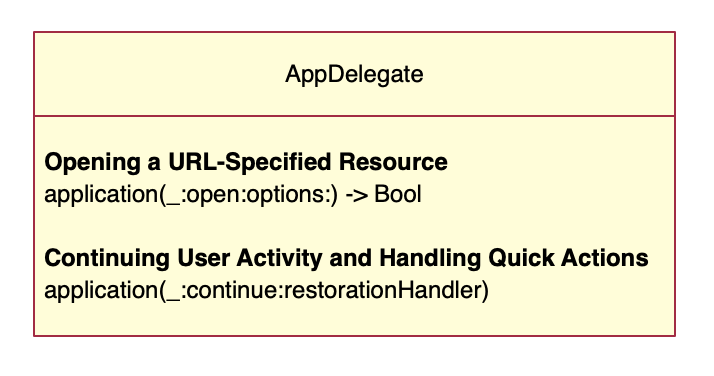
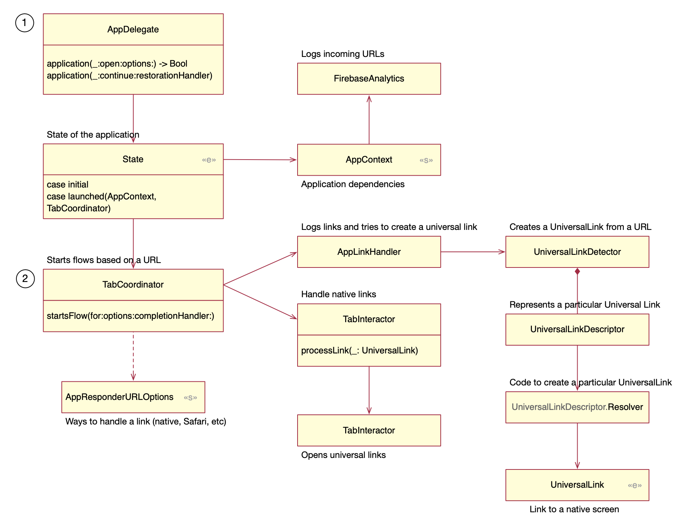
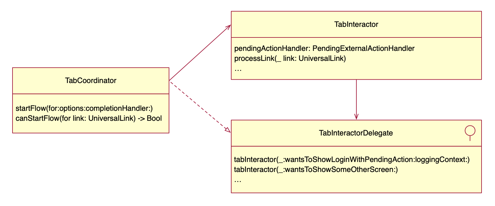
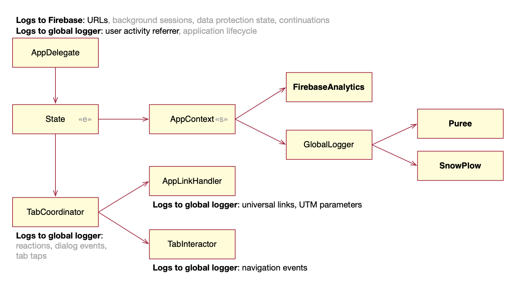

## Universal link

### What is a universal link?

**Universal links** are HTTP or HTTPS URLs that Apple's operating systems recognize as pointing to resources either on the web or in your app. For instance, a URL http://cookpad.com/search/chicken can be loaded as HTML on the web, or as a native controller in a native app.

**To create a universal link:**

- Configure your app by adding an Associated Domain entitlement, plus the code to handle links in the app/scene delegate.
- Configure your website by adding an associated domain file.

Because the entitlement mentions your domain, and the file on your domain mentions your app, this creates a secure two-way association, allowing your app to perform special tasks on behalf of your website.

The flow to load a universal link is as follows:

1. The user installs an application. If the app has an associated domain capability, iOS downloads the associated domain file for the domain.
2. The user loads a standard web link in an Apple app like mobile safari, notes, iMessage. iOS checks if this domain is associated with an installed app.
    - If it isn’t, the URL is loaded in Safari.
    - If it is, the app is launched without ever loading the web page. It’s up to the app to recognize the URL and offer related content.

Universal links are supported in iOS, tvOS, and macOS.

### What is an associated domain?

An **associated domain** is a connection between a domain name and an iOS application.

**To create an associated domain:**

- Configure your app with the associated domain capability.
- Host an AASA (apple-app-site-association) file in the webserver of your domain. This file should contain the bundle id of the app and the paths the app should open.

An associated domain is required to enable the following features:

- App Clips: an App Clip is a small part of an app that lets you do a task quickly. e.g. pay for food, rent a bike. See more.
- Handoff: continue within your apps and websites across multiple devices. Apps that support universal links automatically work with Handoff without requiring further configuration.
- Shared web credentials: sign in to apps using credentials saved in Safari with iCloud Keychain.
- Universal links

### How deep links arrive

The app delegate receives a universal link when the user

- types a URL in Safari
- opens Safari to invoke a Handoff passed from another device
- talks to Siri to trigger a SiriKit intent

<table>
<tr>
  <td>
    
  </td>
  <td>
    

    // Asks the delegate to open a URL
    <a href="https://developer.apple.com/documentation/uikit/uiapplicationdelegate/1623112-application">application(_:open:options:)
    </a>
    

    

    // Asks the delegate to handle a *user activity* (handoff, SiriKit intent, Spotlight search)
    <a href="https://developer.apple.com/documentation/uikit/uiapplicationdelegate/1623072-application">application  (_:continue:restorationHandler:)</a>
    

  </td>
</tr>
</table>

## Cookpad 

Objects involved

- 

**AppContext**
 Holds all the dependencies of the application. Each component that needs to be injected defines its dependencies using composition of protocols. So even when they receive the full object, they only have access to what they need.

- 

**AppResponderURLOptions**

    Represents the ways to open a URL.
    <ul>
      <li>Native: opening a native screen</li>
      <li>Safari: ask Safari to open the link</li>
      <li>Open URL: ask iOS to open the link</li>
      <li>Universal links only: native screen only, don’t fallback to other ways.</li>
    </ul>
    
    
    The `default` property is a set of native, safari, and open url. The first option available wins.
    
    Why isn’t `AppResponderURLOptions` a enum? 
    <ul>
      <li>Using a struct allows adding more cases without editing the code.</li>
      <li>Using a enum
        <ul>
          <li>requires minimal effort to add another case if the source is private</li>
          <li>causes compiler errors indicating where to handle new cases</li>
          <li>lets you define new cases without causing compiler errors by using `@unknown default`</li>
        </ul>
      </li>

- 

**State**
 Represents the state of the app launching/launched. This prevents trying to handle a link while the application is still launching. When the app is launched, the state holds the app dependencies (AppContext) and root coordinator (TabCoordinator).

- 

**TabCoordinator**

    - A **coordinator** is an object that manages navigation and instantiation of controllers. Each coordinator can be thought as a small application, where controllers don’t directly know each other. In Cookpad coordinators are view controllers, which load other view controllers nesting them full screen.

### Pseudocode

① **AppDelegate**

- Ignore the URL if the application is launching
- Call Firebase to log incoming URLs and user activities
- Call the Coordinator 
    - to process a possible OAuth URL
    - to start a flow based on the URL

② **Coordinator**

- Ask the AppLinkHandler to map the URL to a UniversalLink
    - If success, ask the interactor to process the link
    - If failure, try to open the URL as instructed by AppResponderURLOptions

One exception: if the current presented controller is not interruptible, the coordinator doesn’t try to open a native controller. Being interruptible means being marked `ViewCoordinatorInteruptable`.

③ **TabInteractor**

When processing a universal link the TabInteractor checks if the link requires authentication

- If it does, the interactor asks the tab coordinator to run the login flow and try processing the link again
- If it doesn’t, tell the PendingExternalActionHandler to process the link

④ **PendingExternalActionHandler**

- If the app is active, call interactor.performLink(UniversalLink)
- If the app is not active, store the link as `lastAction`. When the application becomes active, the `lastAction` is called from the TabInteractor.viewDidAppear and from didBecomeActiveNotification.

#### Logging

In the figure “UTM” stands for [Urchin Tracking Module (UTM)](https://en.wikipedia.org/wiki/UTM_parameters) parameters. They are URL parameters that indicate sources of traffic to an application.

