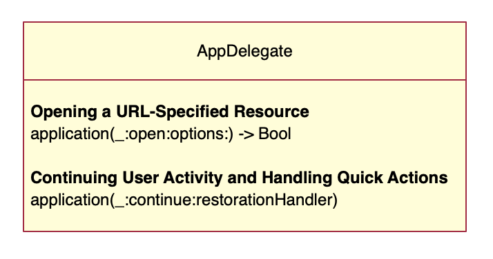
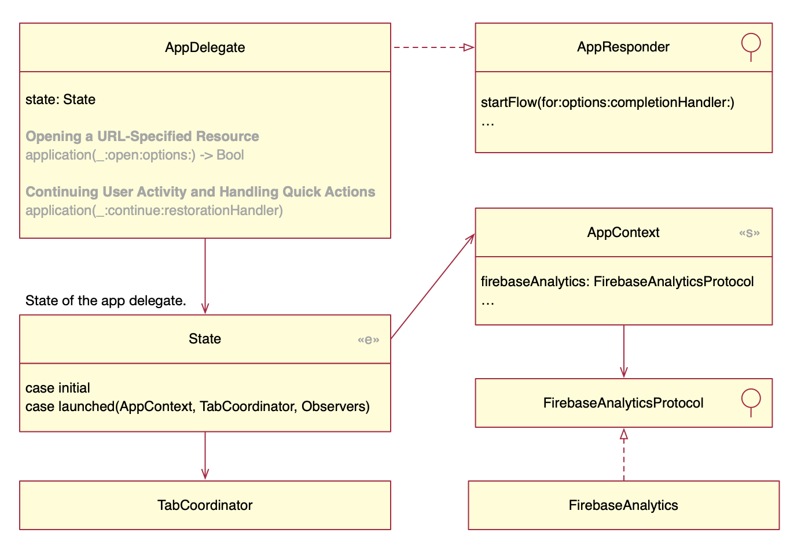

## Universal link

### What is a universal link?

**Universal links** are HTTP or HTTPS URLs that Apple's operating systems recognize as pointing to resources either on the web or in your app. For instance, a URL http://cookpad.com/search/chicken can be loaded as HTML on the web, or as a native controller in a native app.

**To create a universal link:**

- Configure your app by adding an Associated Domain entitlement, plus the code to handle links in the app/scene delegate.
- Configure your website by adding an associated domain file.

Because the entitlement mentions your domain, and the file on your domain mentions your app, this creates a secure two-way association, allowing your app to perform special tasks on behalf of your website.

The flow to load a universal link is as follows:

1. The user installs an application. If the app has an associated domain capability, iOS downloads the associated domain file for the domain.
2. The user loads a standard web link in an Apple app like mobile safari, notes, iMessage. iOS checks if this domain is associated with an installed app.
    - If it isn’t, the URL is loaded in Safari.
    - If it is, the app is launched without ever loading the web page. It’s up to the app to recognize the URL and offer related content.

Universal links are supported in iOS, tvOS, and macOS.

### What is an associated domain?

An **associated domain** is a connection between a domain name and an iOS application.

**To create an associated domain:**

- Configure your app with the associated domain capability.
- Host an AASA (apple-app-site-association) file in the webserver of your domain. This file should contain the bundle id of the app and the paths the app should open.

An associated domain is required to enable the following features:

- App Clips: an App Clip is a small part of an app that lets you do a task quickly. e.g. pay for food, rent a bike. See more.
- Handoff: continue within your apps and websites across multiple devices. Apps that support universal links automatically work with Handoff without requiring further configuration.
- Shared web credentials: sign in to apps using credentials saved in Safari with iCloud Keychain.
- Universal links

## Cookpad 

### AppDelegate

The app delegate receives a universal link when the user

- types a URL in Safari
- opens Safari to invoke a Handoff passed from another device
- talks to Siri to trigger a SiriKit intent
 
<table>
<tr>
  <td>
    
  </td>
  <td>
    

    // Asks the delegate to open a URL
    <a href="https://developer.apple.com/documentation/uikit/uiapplicationdelegate/1623112-application">application(_:open:options:)
    </a>
    

    

    // Asks the delegate to handle a *user activity* (handoff, SiriKit intent, Spotlight search)
    <a href="https://developer.apple.com/documentation/uikit/uiapplicationdelegate/1623072-application">application  (_:continue:restorationHandler:)</a>
    

  </td>
</tr>
</table>

Those two methods extract the URL and pass it to the startFlow method, which logs to Firebase and passes the URL to the coordinator.

Note that the AppDelegate keeps track of its own state, and this state holds the dependencies (AppContext) and the coordinator.

The **AppContext** is an object holding 30+ dependencies of the application. Each component that needs to be injected defines its dependencies using a composition of protocols. So even when they receive the full object, they only have access to what they need.

A **coordinator** is an object that manages navigation and instantiation of controllers. In Cookpad this coordinator happens to be a view controller, which loads other view controllers nesting them full screen. Each coordinator can be thought as a small application, where controllers don’t directly know each other.

Let’s see next how the coordinator handles a deep link URL.

### Coordinator

